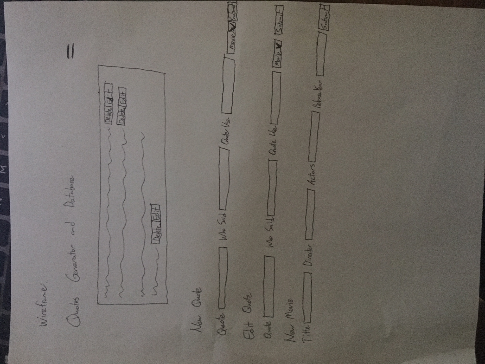
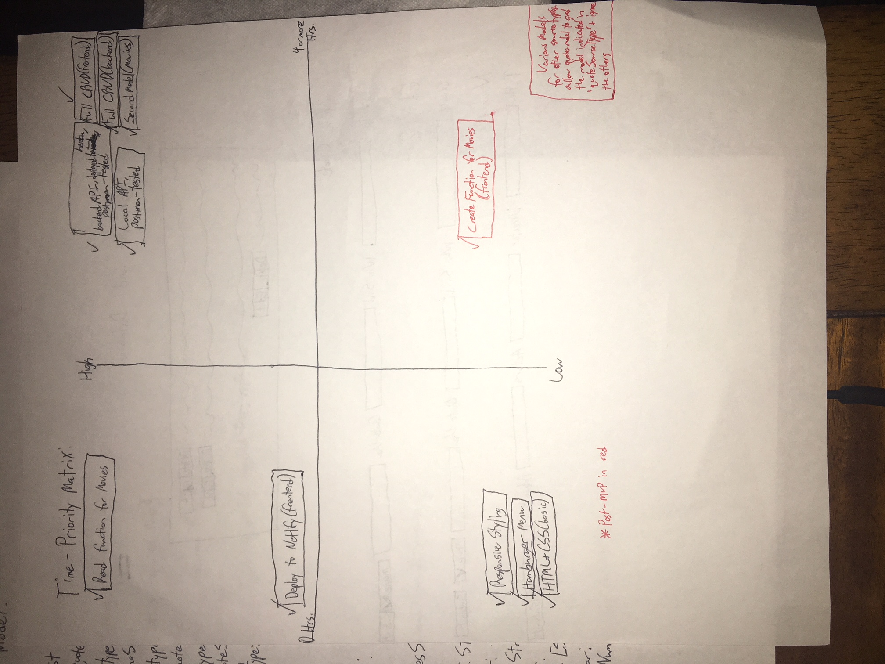

Brandon Balkaransingh
Project Worksheet – Project Two – First App - Frontend
SEI-pineapple

Project Description:
This is the frontend portion for an app that allows a user to input a movie quote and attach it to the movie that it came from. A fellow cohort mate helped me to come up with this idea, so I am very thankful to that person (not a member of this project group)

Project links: 
GitHub Repo: https://github.com/bbalkaransingh23888/project-2-frontend

Backend Repo: https://github.com/bbalkaransingh23888/project-2-backend.git

Google Sheet link: https://docs.google.com/spreadsheets/d/1DRhpnHYU-LVnRYKSALXm_xbMCZ3FsTs6Zl-VJ1MU49E/edit#gid=0
I should be on line 3 on the Google sheet

Wireframe:

Wireframe: 
 

Time-Priority Index: 
 
MVP list:
1)	Full CRUD to create, read, update/edit, and delete a quote (an array of quotes really) all on the front end utilizing backend CRUD functions
2)	Deploy to netlify
3)	Responsive styling
4)	HTML and CSS
5)	Hamburger menu
6)  Read function for movie model minimum  

Post-MVP: 
1)	Create function for my movie on the frontend also 

Functional Components: 

MVP:

|Component|Priority|Est. Time|Time Invested|Actual Time|
|---------|--------|---------|-------------|-----------|
|Full CRUD on frontend(quotes)|HIGH|7 Hrs.|7 Hrs.|7 Hrs.| 		
|Deploy to netlify|Medium|< 1 Hr.|< 1 Hr.|< 1 Hr.| 		
|Responsive styling|Low|< 1 Hr.|< 1 Hr.|< 1 Hr.| 		
|HTML and CSS|Low|< 1 Hr.|< 1 Hr.|< 1 Hr.| 		
|Hamburger menu|Low|< 1 Hr.|< 1 Hr.|< 1 Hr.|
|Read function for movies|High|< 1 Hr.|<1 Hr.|<1 Hr.|		
		

Post-MVP:

|Component|Difficulty|Est. Time|Time Invested|Actual Time|
|---------|--------------------|---------|-------------|-----------|
|Create function on frontend for movies|Low|3 Hrs.|< 1 Hr.|< 1 Hr.|

